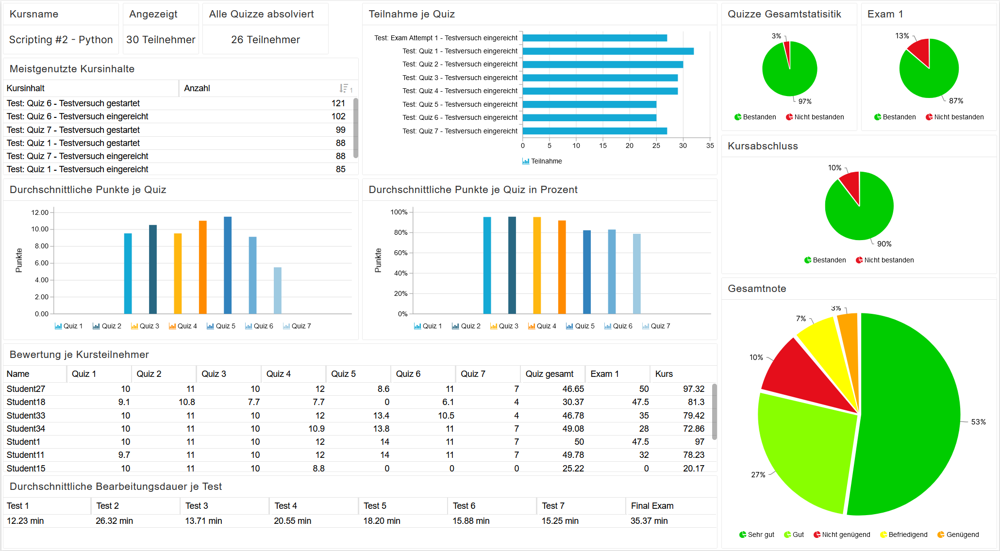
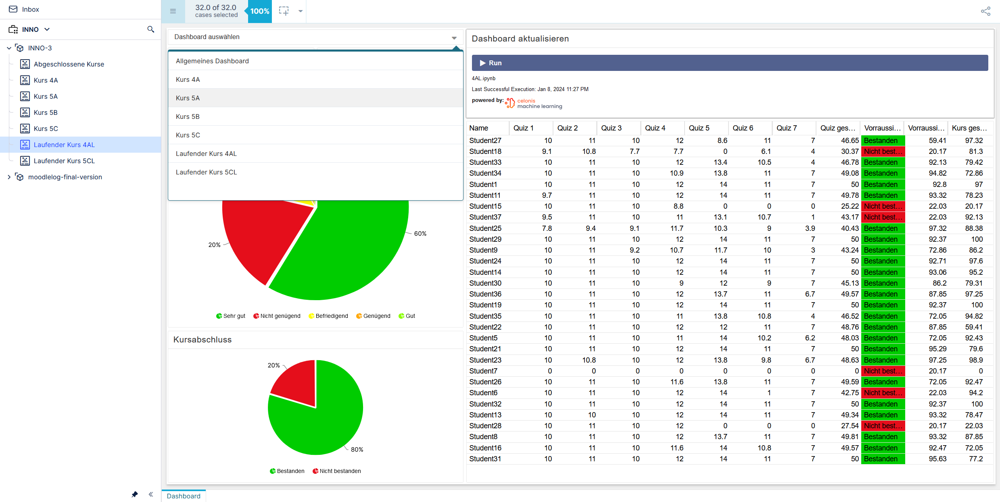

# ProcessMining

During the BIF-INNO project, a Teaching Analytics Platform utilizing Celonis to visualize processed data derived from anonymized Moodle logs was successfully developed. This repository includes log files, parsers, and machine learning tools. For detailed information, please refer to the README.md files within the respective subfolders.

## INNO-1
In the BIF-INNO-1 course, a basic dashup visualizing complex data extracted from the Moodle API was created. Furthermore the project includes the a parser written in C++ that extracts necessary data to be processed by Celonis.

## INNO-2
Throughout the BIF-INNO-2 course, three machine learning models, capable of calculating an expected course outcome were compared: decision tree model, linear regression and nearest neighbour. Notably, the decision tree model demonstrated the highest accuracy.

Here is a comparison of Expected Results vs. Decision Tree Results vs. Linear Regression Results:

|Name     |Quizzes|Exam 1|Expected Results|Decision Tree Result|Linear Regression Result|
|---------|-------|------|----------------|--------------------|------------------------|
|Student7 |0      |0     |0               |20,17               |0                       |
|Student37|43,17  |48    |92,13           |22,03               |78,17                   |
|Student18|30,37  |47,5  |81,3            |20,17               |53,72                   |
|Student23|48,63  |50    |98,9            |97,25               |88,6                    |
|Student15|25,22  |0     |20,17           |22,03               |43,88                   |
|Student9 |43,24  |43    |86,2            |72,86               |78,31                   |
|Student28|27,54  |0     |22,03           |20,17               |48,32                   |
|Student5 |48,03  |45    |92,43           |72,05               |87,46                   |
|Student8 |49,81  |40    |87,85           |97,25               |90,86                   |
|Student6 |42,75  |50    |94,2            |22,03               |77,37                   |
|Student25|40,43  |46,7  |88,38           |97,32               |72,94                   |
|Student29|50     |50    |100             |92,37               |91,22                   |
|Student19|50     |50    |100             |92,37               |91,22                   |
|Student31|50     |31    |77,2            |95,63               |91,22                   |
|Student33|46,78  |35    |79,42           |97,25               |85,07                   |
|Student30|45,13  |36    |79,31           |72,86               |81,92                   |
|Student22|48,76  |17    |59,41           |87,85               |88,85                   |
|Student16|49,57  |27    |72,05           |93,32               |90,4                    |
|Student36|49,57  |48    |97,25           |87,85               |90,4                    |
|Student26|49,59  |44    |92,47           |72,05               |90,44                   |
|Student27|46,65  |50    |97,32           |59,41               |84,82                   |
|Student34|49,08  |28    |72,86           |92,47               |89,46                   |
|Student35|46,52  |48    |94,82           |72,05               |84,57                   |
|Student32|50     |50    |100             |92,37               |91,22                   |
|Student14|50     |46    |95,2            |93,06               |91,22                   |
|Student24|50     |48    |97,6            |92,71               |91,22                   |
|Student1 |50     |47,5  |97              |92,8                |91,22                   |
|Student11|49,78  |32    |78,23           |93,32               |90,8                    |
|Student21|50     |33    |79,6            |95,29               |91,22                   |
|Student13|49,34  |32,5  |78,47           |93,32               |89,96                   |

## INNO-3

Lastly, wa Teaching Analytics Platform capable of accommodating multiple Moodle courses was created. The data handling approach in Celonis was entirely reimagined to eliminate redundancy. Incomplete dashboards now possess the capability to predict the final course outcome. Additionally, the parser was reimplemented using Python.

